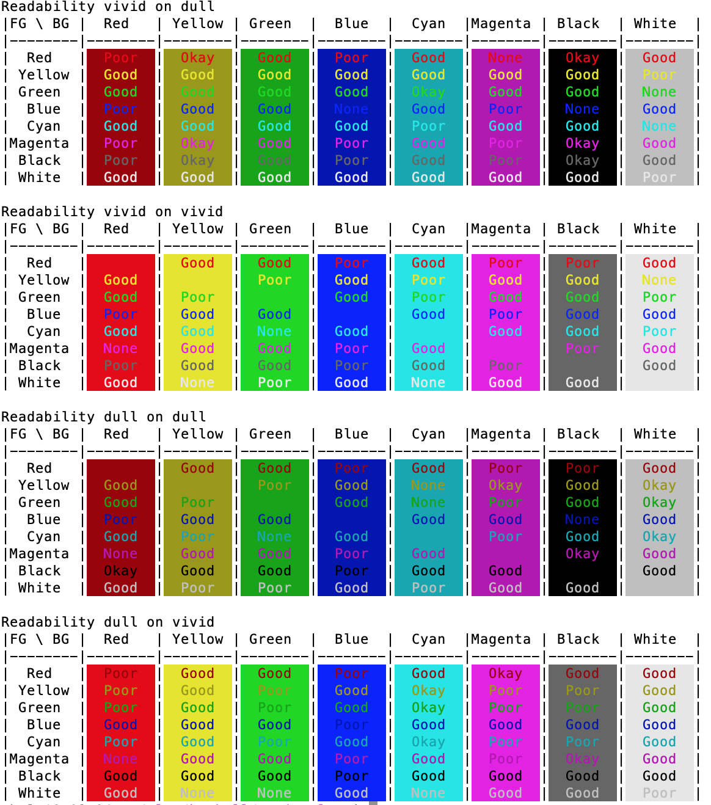

# visualize-ansi-colors

A small tool to visualize how something printed in a any ANSI foreground color would look like on any ANSI background color.

In the project root, `stack run` produces such output:

